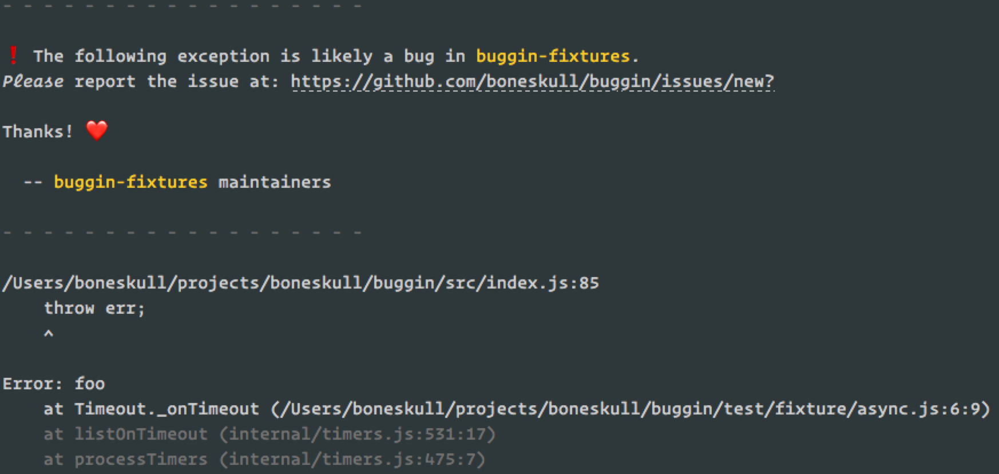

# buggin

> :bug: help users report errors from your buggy app :grimacing:

## What `buggin` Is

`buggin` will intercept uncaught exceptions (and unhandled rejections) from your app, and ask the user to create a bug report. It looks like this:



The new issue will be pre-filled with the exception and other info. Neat!

## What `buggin` Ain't

`buggin` will not attempt to determine whether or not the _exception was thrown from your code_.

Exceptions which originate in your package's dependencies _may_ be because of misuse ("user error" on your part) _or_ an actual bug in the dependency--there's really no way to tell. Either way, such a bug should be reported, so a maintainer of a package using `buggin` can triage and determine if it's an "upstream" problem or not.

## Install

**Currently, `buggin` only works with repos hosted on GitHub.**

The usual:

```bash
npm i buggin
```

## Usage

### Basic Usage

You only need to call `buggin()` once. You should do this in your CLI app entry point (the script in your `bin` prop of `package.json`).

```js
#!/usr/bin/env node
// your other requires go here

require('buggin')(module);

// start doing stuff with args
```

### Advanced Usage

#### Custom Messaging

To override the default message, create a `BugginMessageBuilder` function which accepts a `BugginMessageBuilderData` object and returns a `string`. Pass this to `buggin`'s options object via property `builder`.

Example:

```js
require('buggin')(module, {
  builder: ({
    /**
     * - `true` if error came from a unhandled rejection
     * @type {boolean}
     */
    isPromise,
    /**
     * - Project name
     * @type {string}
     */
    projectName,
    /**
     * - New issue URL
     * @type {string}
     */
    url,
    /**
     * - Original error
     * @type {Error}
     */
    error,
    /**
     * - `true` if the terminal supports color
     * @type {boolean}
     */
    supportsColor
}) => {
  return `my custom message. please make a new issue here: ${url}`;
});
```

Note that the error message and stack trace is _always_ displayed after `buggin`'s output. The idea is that you could use it to _conditionally change_ the message output (if needed).

If you want colors or emoji, you're on your own; `buggin` uses [ansi-colors](https://npm.im/ansi-colors) and [node-emoji](https://npm.im/node-emoji) internally.

Emoji and colors are automatically stripped if the terminal lacks support. Or...that's the idea, anyway. Colors for sure.

#### Use With Existing Process Event Listeners

If your module (or some module you're consuming) listens on [Process.uncaughtException](https://nodejs.org/dist/latest-v12.x/docs/api/process.html#process_event_uncaughtexception) or [Process.unhandledRejection](https://nodejs.org/dist/latest-v12.x/docs/api/process.html#process_event_unhandledrejection), `buggin` will refuse to set up its own listeners, print a message to `STDERR` with a warning, and exit the process.

If you'd still like to try it, pass `force: true` to the options argument:

```js
buggin(module, {force: true});
```

Because your own listeners could do literally anything and `buggin` can't know what it is they are doing, you'll just have to try it.

#### Manual Configuration

The [auto-configuration](#auto-configuration) behavior can be overridden by a few other options:

```js
// custom package name
buggin(module, {name: 'custom name'});

// custom package json with custom entryPoint (for stack sniffing)
buggin(require('/path/to/package.json'), {entryPoint: '/my/package/root/'});

// path to package.json
buggin('/path/to/package.json');
```

#### Ignoring Certain Errors

You can pass `buggin` a selector function to help it determine whether an `Error` should be ignored by `buggin`.

This is helpful if a certain class of `Error`s are _known_ or _expected_. For example, if you expect your app to throw an `Error` with a code property of `EISDIR`, you can use the following code, and `buggin` will not intercept the exception:

```js
buggin(module, {reject: err => err.code === 'EISDIR'});
```

> Editor's Note: It's probably a better idea to actually catch these exceptions so they don't become uncaught, right?

Because of the nature of the problem--we're trying to get bug reports for _unexpected_ errors--`buggin` does not support an "accept" selector function, would return `true` if the `Error` was to be handled by `buggin`. To write such a function, you'd need to _know something_ about the errors you want `buggin` handle, and in so, defeating the purpose.

## How It Works

`buggin` does what it thinks is correct, but its understanding of what "correct" means is up for [further discussion](https://github.com/boneskull/buggin/issues).

### Interception of Uncaught Exceptions & Unhandled Rejections

`buggin` _prepends_ a listener to both the [Process.uncaughtException](https://nodejs.org/dist/latest-v12.x/docs/api/process.html#process_event_uncaughtexception) and [Process.unhandledRejection](https://nodejs.org/dist/latest-v12.x/docs/api/process.html#process_event_unhandledrejection) events. If one of these events is emitted _with an `Error` argument_, `buggin` will:

1. Print a notification to `STDERR` and a link to the "new issue" page. If the user's terminal supports it, the URL will be displayed as a clickable link, with the requisite querystring hidden; otherwise the entire URL (with query string) will be displayed for the user to copy/paste.
2. `buggin` disables _all_ of its listeners (including this one).
3. `buggin` makes a choice:
   1. If there's no other listener _which was not added by `buggin`_ for the emitted event, the error...
      1. ...if an uncaught exception, will be _rethrown on the next tick_ out of `buggin`'s listener.
      2. ...if an unhandled rejection, will be _re-rejected_ from the handler.
   2. In both above "pass through" situations, `buggin` attempts to mimic the default behavior as closely as possible. It _will_ suppress the callsite of its rethrow/rejection, which is unhelpful because ti will point to code in `buggin`. _There may be a way to save this info from the original error?_
   3. If there _is_ another listener, `buggin` will _not_ rethrow (nor re-reject), and will continue to the next listener as per standard Node.js EE behavior.

### Auto-Configuration

`buggin` attempts to automatically determine the package name and the URL from your package's `package.json`. The logic is kind of gross, but by default, it looks for _closest `package.json` to the main (entry) script_, and pulls the info out.

## Motivation

This is the _opposite_ of "This is probably not a problem with npm." The fact is, if someone is running your CLI app (and you aren't invoking someone else's code), it _is_ your problem. Wouldn't you like to fix it?

Most users don't bother to report bugs, so maybe this will help!

## Caveats

- This module is _intended_ for use with CLI apps. That said, if you have an idea for better library support, [propose something](https://github.com/boneskull/buggin/issues)!
- Only a single package can use `buggin` at once. If the ["main" module](https://nodejs.org/api/modules.html#modules_require_main) uses `buggin`, it will be preferred over all others; any attempts to use `buggin` after (or before!) the "main" module does will be ignored. If the consumer is _not_ the main module, then only _the most recent_ package to call `buggin` "wins."
- Under normal circumstances, Node.js will exit with code 7 if an uncaught exception is handled and rethrown from the listener. Because `buggin` does not rethrow out of the listener _per se_--and instead rethrows on "next tick"--the process will exit with code 1 (as if no such handling occurred).
- Behavior on unhandled rejection depends on the version of Node.js used. Node.js v12 added a [`--unhandled-rejections-mode` option](https://nodejs.org/api/cli.html#cli_unhandled_rejections_mode), which allows for greater control over whether an unhandled rejection is considered a "warning" or a nonzero-exit-code-producing error.
- `buggin` ignores non-`Error` exceptions or rejections.
- `buggin` throws stuff in the `global` context (a singleton prop called `buggin` which stores its configuration) to deal with multiple usages more gracefully. Deal with it!

## TODO

- Custom output template
- Custom issue template (can we reference an existing GitHub issue template?)

## License

Licensed Apache-2.0
